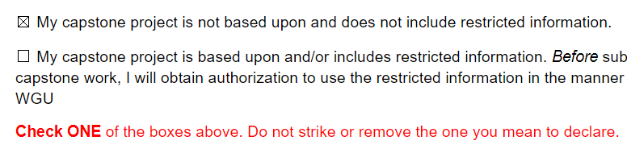

(task1)=
# Task 1: Topic Approval
<!-- hack to open links in new tab -->
<head>
    <base target="_blank">
</head>

## Choosing a Topic

The approval form ensures you start in the right direction before investing time and effort into task 2. Evaluators look for our (instructors') signature, and we look for the following:

1. An application of machine learning (ML). 
2. An organizational need for your ML application to help solve. 
3. A *basic outline* of your implementation plan.

```{margin} What is *machine learning*?
It's a new field, and answers vary depending on who ask. But for the purposes of this project, ML is the application of an algorithm to data.
```
The "organizational need" requirement gives your project a purpose and audience. From an assessment perspective, it has little other value; so you need not worry about the profitability or practical impact of your project. Such criteria are *not* assessed. This is a computer science project; neither you nor the evaluators are business majors.  

 But you can't apply an algorithm to data -without data.

#### Data

A machine learning application is the hard requirement of the capstone, but you can't apply an algorithm to data -without data. Most any dataset provides a question to answer, e.g., predictions, classifications, or recommendations for which an "organizational need" can always be found.   

- [Kaggle.com](https://www.kaggle.com/datasets)
- [Google Dataset Search](https://datasetsearch.research.google.com/)
- [Data.gov](https://data.gov/)
- More [here](https://careerfoundry.com/en/blog/data-analytics/where-to-find-free-datasets/) and [here](https://medium.com/analytics-vidhya/top-100-open-source-datasets-for-data-science-cd5a8d67cc3d)
- Simulated data

```{note}
*No minimal data complexity or processing is required.* Choosing data needing less processing can make the project technically more accessible.  
```
#### Machine Learning Algorithms

:::{sidebar} **Classification & Regression Overview** 
<iframe 
src="https://wgu.hosted.panopto.com/Panopto/Pages/Embed.aspx?id=b3a9a4e9-c126-407d-a6b2-ae0100fde1ba&autoplay=false&offerviewer=true&showtitle=true&showbrand=true&captions=true&interactivity=all" style="border: 1px solid #464646" allowfullscreen allow="autoplay"
> </iframe>
:::

**Supervised Learning**
If the answers for what you are trying to predict (dependent variable) are in the data, then a supervised method is the way to go. Using the other features (independent variables) as input, a supervised algorithm can *train* a function to predict a dependent variable for new unseen dependent variables. If predicting numbers, e.g., profit, temperature, etc., a *regression* method should be used. If predicting a category, e.g., yes/no, blue/red, spam/ham, etc., a *classification method should be used.

- *Regression* algorithms include linear regression, polynomial regression, decision tree regression, random forest regression, and many more.
<!--  https://www.kaggle.com/code/duyguay12/regression-examples-for-machine-learning -->

-*Classification* algorithms include logistic regression (see the margin), naive Bayes, support vector machine, decision tree, and many others.  

```{margin} Logisitc regression: regression or classification?
Really both, but most often it's used for classification. Logisitic regression uses input variables to predict the *probability* of an outcome returning a number between 0.0 and 1.0 -hence "regression." However, using that probability to predict whether an outcome occurs (yes/no) is a classification.     
```

**Unsupervised Learning**
If what you are trying to find is not directly in the data(*tagged* or *labeled*), then an unsupervised method might be used. Unsupervised algorithms identify patterns not identified in the data. Common approaches include clustering (e.g., k-means clustering, expectation-maximization distribution, and agglomerative hierarchical), dimensionality reduction (e.g., PCA and LDA), and anomaly detection (e.g., outlier factor and isolation forest)

**Reinforced Learning**
Sometimes solutions need to adapt to particular situations. That is the algorithms need to learn how to make decisions. For example, a robot needs to navigate a never before seen maze. By awarding (or punishing) a robot's state after decisions, an algorithm can be progressively trained to predict decisions maximizing results. Reinforced methods can be more difficult to develop than supervised or unsupervised methods.      

```{note}
No idea which algorithm will work best? That's OK! You won't know until you've spent time investigating and experimenting. But that's not the point of task 1. *Any ML method* given in task 1 appropiate for your data will be accepted, and task 2 can do something different without needing to revise task 1 (see the [FAQ](task1:faq) below).   
```

### Where to start? Data or the ML algorithm? 

It's best to consider both. In a "real-world" scenario, you would likely be given data to analyze and a problem to solve. So starting with the data, and then determining the proper ML tools is most natural. However, you get to choose the problem and hence the tools needed to solve it -provided you have data fitting that problem. For example, someone interested in image recognition might restrict their data search to sets of labeled images. To simplify coding steps, they might look at images with standard sizes or take a subset of the images limiting the number of classifications. At any point, the problem or choosen algorithm can be refined to better fit what you want or can do. A suggested approach:

1. Find some data to match your preferred ML method. 
2. Find an ML algorithm you can apply to that data.
3. Formulate an "organizational need" helped by that application.

```{margin} Unsure about which ML method to use?
Look for labeled data for which a supervised learning classification method can be apllied. This method most easily fits all the rubirc requirements. 
```

(task1:choosing:examples)=
### Examples

#### Topic Summary Examples:

`````{tab-set}
````{tab-item} Example 1
> **Data:** Petal dimensions and species of fifty [Iris Samples](https://www.kaggle.com/datasets/uciml/iris).
>
> **ML application (non-descriptive method):** [Classify an Iris's species using its petal dimensions using, say SVN or Logistic regression](resources:task2c:videos:ml-sup-class-code).
>
> **Descriptive method:** Histograms showing distributions of different flower features and confusion matrix illustrating the accuracy of the classification model.
>  
> **Organizational Need:** *Grow Fast Ferilizer Inc.* needs to help customers identify their flowers. 
````
````{tab-item} Example 2
> **Data:** Housing data
>
> **ML application (non-descriptive method):** Predict the selling price of a house using a regression model, say random forest or linear regression.      
>
> **Descriptive method:** Histograms showing distributions of data features and scatterplots exploring possible data correlations.  
>
> **Organizational Need:** A realty firm needs a tool to estimate housing prices.
````
````{tab-item} Example 3
>**Data:** Movies, e.g., budget, genre, starring actors, etc.
>
>**ML application (descriptive method):** Use unsupervised clustering, say K-means, to identify groups of similar movies.
>
>**Non-descriptive method:** Using the clusters and user input, recommend a movie.
>
>**Organizational Need:** InterWebFlixs.com needs to help users pick a movie.
````
````{tab-item} Example 4
> **Data:** Images of dogs and cats.
>
> **ML application** (non-descriptive): Classify an image as a dog or cat using a neural network, say CNN.
>
> **Descriptive method:** Histograms showing distributions of image features and a confusion matrix illustrating the accuracy of the classification model.
>
> **Organizational Need:** *We Love Pets Inc.* wants to use customer-uploaded images to market the correct type of pet food. 
````
`````
#### Completed Examples

These are (slightly modified) examples of approved topics. All of which went on to become passing capstone projects.

TODO: THUMB IMAGES SHOULD UPDATE WHEN ADDED TO REP

(task1:completedexamples)=
`````{tab-set}
````{tab-item} Completed Task 1 Ex. A
> [](https://github.com/ashejim/C964/blob/main/resources/example_task1-a.pdf)

Also see: [task 2 example A](https://github.com/ashejim/C964/blob/main/resources/example_task2-a.pdf)
````
````{tab-item} Completed Task 1 Ex. B
>[](https://github.com/ashejim/C964/blob/main/resources/example_task1-b.pdf?raw=true)

Also see: [task 2 example B](https://github.com/ashejim/C964/blob/main/resources/example_task2-b.pdf)
````
`````

**Example A:** 

- [task 1 ex. A](https://github.com/ashejim/C964/blob/main/resources/example_task1-a.pdf) 

- [task 2 ex. A](https://github.com/ashejim/C964/blob/main/resources/example_task2-a.pdf)

**Example B:** 

- [task 2 ex. B](https://github.com/ashejim/C964/blob/main/resources/example_task1-b.pdf) 

- [task 2 ex. B](https://github.com/ashejim/C964/blob/main/resources/example_task2-b.pdf)

**WGU Capstone Excellence Archive**

The [Capstone Excellence Archive](https://westerngovernorsuniversity.sharepoint.com/sites/capstonearchives/excellence/Pages/UndergraduateInformation.aspx) includes a wide range of completed projects. Reviewing them may help in getting ideas, providing inspiration, and understanding the requirements. However, keep in mind that they all are *above and beyond* the requirements. Therefore, don't use these as examples of what's needed to meet the requirements. For a more down-to-earth example of what's required, see the [tasks 1 and task 2 examples](task1:task1examples) above.

(task1:approval)=
## Topic Approval

Once you've decided on a topic, complete the approval form following the template below and *email it to your [C964 assigned instructor](mailto:myC964capstoneinstructor@wgu.edu?cc=my%20course%20instructor&subject=C964:%20capstone%20topic%20approval) for approval.*

> [](https://westerngovernorsuniversity-my.sharepoint.com/:w:/g/personal/jim_ashe_wgu_edu/EaH8yexFJjhDp5hnrcAZeKoB6XxU9r8Z5IH1QqVLmVu87w?e=OwRtpe)

**Project topic and purpose:** Describe the problem (the "organizational need") your project will solve.   

**Non-descriptive method(s):**  These are methods that infer from the data, i.e., make predictions or prescriptions. Examples include classification models, regression, image recognition, etc. 

**Descriptive methods:** These methods describe and help understand the data, e.g., mean, median, bar plot, scatterplot, k-means clustering, etc. Three visualizations are required. The visualizations are typically descriptive and can count as your descriptive method.

```{warning}
You must identify a machine learning application in either the descriptive or non-descriptive section. Most often the non-descriptive method uses ML, e.g., a classification model allowing the user to provide input and the app predicts the outcome.   
```

```{note}
The approval form only needs to be a *rough* outline of a passing project. **Changes from task 1 to task 2 are allowed and expected.** As figuring out the finer details of a complex project takes time and effort which you won't invest until task 2.   
```

Directly emailing your assigned course instructor is the fastest and often best way to get a signature. Whether emailing [ugcapstoneit@wgu.edu](mailto:ugcapstoneit@wgu.edu?cc=my%20course%20instructor&subject=C964:%20capstone%20topic%20approval) or your CI directly, always practice professional communication:
* Use your WGU email.
* Provide a subject, your capstone course (we support all IT college capstones), and your program mentor's name (if not in your signature).
* Clearly state your questions or requests. 

```{warning}
The submitted topic approval form must be *signed by a C964 course instructor*. Forms without a signature are automatically returned without further review.  
```
(task1:waiver)=
## Waiver Form

Everyone must submit a waiver form stating either no restricted information was used, OR the use of any restricted information is authorized. 

> [](https://westerngovernorsuniversity-my.sharepoint.com/:w:/g/personal/jim_ashe_wgu_edu/ESLuMNRuDjpCrKvqWaC6cywB4I97WEPdk5MRZRq4LfmFhQ) 

For topics based on actual work projects, obtaining authorization can be avoided in most cases by fabricating or masking identifying information.      

:::{note}

:::

(task1:faq)=
## FAQ

**Do I need to set up an appointment to get approval?**

No. Usually, students email the approval form to their instructor. We then sign to form or follow up with questions. However, if you have questions about the requirements or difficulty choosing a topic, you are encouraged to set up an appointment. A 15-30 minute phone call can address most questions or concerns. 

**What if I start working on task 2 and want to change things? Do I need to resubmit task 1?** 

No, not unless it's an entirely different topic. Minor changes from task 1 to task 2 are expected and allowed *without updating the approval form*. Evaluators will not rigorously compare tasks 1 and 2. Task 2 is where the work is, and even with complete topic changes at most, you'll be asked to revise the approval form (if at all). So never let task 1 dictate what you do in task 2.    

**Can I use projects from other WGU courses?**

You can use any of your work or academic projects (at WGU or elsewhere) provided no proprietary information is used without permission. Don't worry about self-plagiarism, as the similarity check will identify and ignore it. Just as in reusing work projects, expect to modify and remold past academic assignments to meet the project requirements.

**Can I use my C951 task 3? Should I use it?**
You can use anything you’ve written for C964, including copying verbatim from C951 task 3. If it’s convenient, feel free to do it. But at best, the time saved is little. At worst, you might get bogged down trying to work on two projects simultaneously and going with an unnecessarily complex C964 topic.

Here are some points to consider:
- C951.3 is just a written project, typically around five pages (I'm guessing; ask your C951 instructor), and can be completed in a single afternoon. Comparatively, C964 requires a working machine learning application and accompanying documentation, typically around 20 pages. 

- C951.3 only relates to parts A and B of C964.2. These parts are just a framework for communicating the project to a general audience and almost always pass. Furthermore, they’ll have to be at least partially rewritten anyways. Parts C and D of C964 are what evaluators care about.
- Rewriting content C951.3 for a different C964 topic will not take much additional work.
- As it’s just a written project, students often pick a complex topic for C951.3. But then they feel pressured to use the same complex topic for C964 and struggle with creating the app.
- Trying to comprehend two projects at once is just more difficult. 
 
Whatever you do for C964 can meet the requirements of C951 task 3. If you have plenty of time, you might choose to complete C964 first.  

(task1:faq:confusingrubric)
**The rubric is confusing! The directions seem to require items outside the scope of the project, e.g., "implementation of interactive queries." The directions have parts A, B, C, and D; but the rubric has "Outcomes" 1-6. How do these align?**

*We do not advise following the official rubric for C964.* Follow the guidelines found on this webpage and the [Task 2 template](https://westerngovernorsuniversity-my.sharepoint.com/:w:/g/personal/jim_ashe_wgu_edu/ESLuMNRuDjpCrKvqWaC6cywB4I97WEPdk5MRZRq4LfmFhQ). Because of the ambiguity of the official rubric (how do directions A-D align with Outcomes 1-6?), this template has seemingly become the defacto rubric and is what evaluators come to expect. So while following the template format is not technically required; it is highly recommended. 

Reserve the template section titles and order and submit all four parts as a single document. With a long, complicated document, aligning content to assessed competencies presents a challenge. Don’t make things difficult for the evaluator by spreading the content over several documents in an unfamiliar format.

**Do I need an "electronic signature" as specified in the official rubric?**

No, you can type in your name, use a "fancy" font, or insert an image of your signature.  

**What are the common reasons for task 1 being returned?**

1. No instructor signature on the approval form. You need to send it to us and get a signature *before* submitting it.
2. Both or neither box is marked on the waiver form. Mark one and only one box. 

**How many attempts are allowed for each task?**

You have unlimited attempts for both tasks 1 and 2. However, incomplete submissions or submissions significantly falling short of the minimum requirements may be *locked* from further submissions without instructor approval. Furthermore, such submissions do not receive meaningful evaluator comments. 

**What is a descriptive method?**
Anything that describes the data. Histograms, scatterplots, pie charts -all the familiar descriptive statistics techniques are included. ML methods such as k-means clustering can also be descriptive. Whether a method is descriptive or non-descriptive is determined by its use. For example, using a regression line to describe the relationship between variables is descriptive, but using the line to predict a variable or claim a correlation between the variables exist is inferential (non-descriptive)   

**What is a non-descriptive method?**

Anything that infers from the data, e.g., making predictions, recommendations, identifying correlations, inferring from correlations, etc. Also, see the comments above. 

**What is machine learning?**

That depends on who you ask! But for this project, it is an algorithm applied to data. 

For computer science, Machine learning is a subfield of artificial intelligence (which is a subfield of mathematics), broadly defined as the development of machines capable of self-adjusting behavior based on data. However, from the data science perspective, machine learning is generally defined as the practice of using algorithms to identify patterns, make predictions, etc. from data. That is, machine learning is a goal, not a technique. So for example, a data scientist (and the evaluators) consider linear regression machine learning -when it's used as a prediction model, but a mathematician would politely (or not so politely) disagree.       

**Can I use libraries outside the standard (Python, Java, etc.) installation?**

Yes. Unlike C950 (Data Structures & Algorithms II), you are allowed and encouraged to use outside libraries. All the major languages, but particularly Python, have a wide array of highly developed ML tools. The C964 capstone is about the application of these tools -not their development.   

TODO ADD PICTURES

**What language, libraries, and platforms should I use?**

You can use whatever you like. However, we recommend using Python and the [scikit-learn](https://scikit-learn.org/stable/) (aka sklearn) library. In addition to having a large collection of ML-specific tools and tutorials, WGU has better faculty support for these. For the app front end, Jupyter notebook is a great place to start. Passing applications are often submitted as the notebook (.ipynb) and data files. Jupyter notebooks are a great way to present code and information together, but can also progressively be developed into a more polished product. Students are often tempted to use Jave because of their JavaFx experience in software II, but a GUI is not required and Python is better suited.

A development path might look like the following:

- Python IDE &rarr; Jupyter notebook &rarr; notebook with widgets &rarr; hosted notebook with widgets &rarr; web app. 

Provided the [minimal app criteria](task2c:appreqs) are met, submitting at any point along this path will pass part C. 

**What sort of user interface do I need? Do I need a GUI?**

No, a GUI is *not* required. Your app must be usable by the "client" towards solving the proposed problem. If the evaluators can get run your app as intended playing the role of the "client" following your [user guide](task2_doc:userguide), then your app will be considered to have a user-friendly interface. This can be done through a GUI and widgets but using the command line or reading user data from a local directory will also suffice. 
